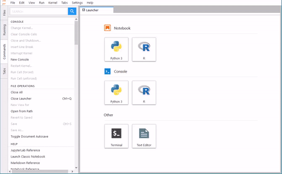
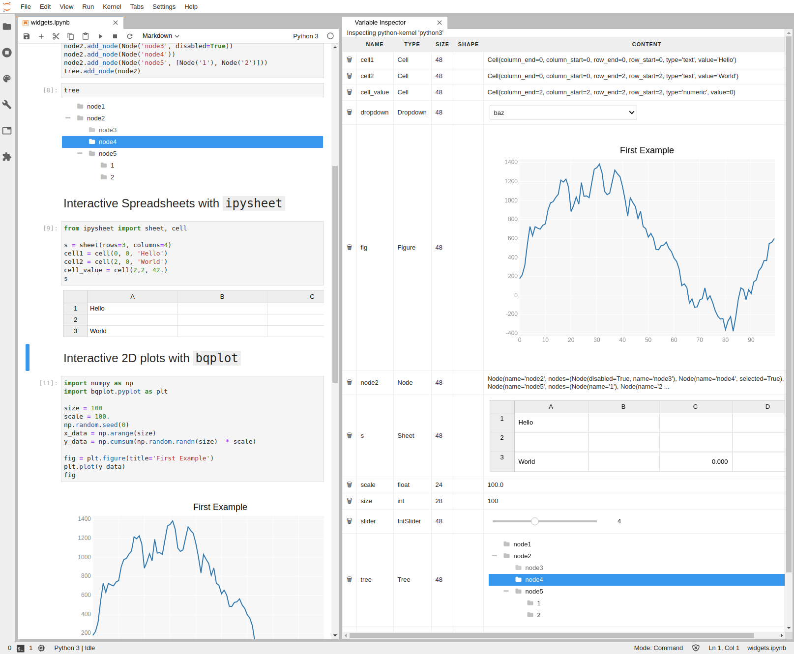

# jupyterlab_variableinspector

[](https://jupyterlab-contrib.github.io/)


[](https://mybinder.org/v2/gh/jupyterlab-contrib/jupyterlab-variableInspector.git/master?urlpath=lab)

Jupyterlab extension that shows currently used variables and their values.  
Contributions in any form are welcome!

## Features



- Allows inspection of variables for both consoles and notebooks.
- Allows inspection of matrices in a datagrid-viewer. This might not work for large matrices.
- Allows an inline and interactive inspection of Jupyter Widgets.

### Supported Languages

- This extension is currently targets `python` as a main language but also supports the following languages with different levels of feature completeness
  - `R`
  - `scala` via the [almond kernel](https://github.com/almond-sh/almond)

### How it Works

In order to allow variable inspection, all content that is displayed first need to be sent from the kernel to the front end.  
Therefore, opening large data frames with the datagrid viewer can dramatically increase your occupied memory and _significantly slow down_ your browser.  
Use at your own risk.

## Requirements

- JupyterLab >= 3.0

### Requirements for `python` functionality

- `pandas` and `numpy` are required to enable matrix inspection.
- `pyspark` for spark support.
- `tensorflow` and `keras` to allow inspection of tf objects.
- `torch` for PyTorch support.

### Requirements for `R` functionality

- The `repr` library.

### Requirements for `ipywidgets` functionality

The variable inspector can also display Jupyter interactive widgets:



The requirements for this functionality are:

- `ipywidgets`, which can be installed with `pip install ipywidgets`.

## Install

To install the extension, execute:

```bash
pip install lckr_jupyterlab_variableinspector
```

## Uninstall

To remove the extension, execute:

```bash
pip uninstall lckr_jupyterlab_variableinspector
```

## Contributing

### Development install

Note: You will need NodeJS to build the extension package.

The `jlpm` command is JupyterLab's pinned version of
[yarn](https://yarnpkg.com/) that is installed with JupyterLab. You may use
`yarn` or `npm` in lieu of `jlpm` below.

```bash
# Clone the repo to your local environment
# Change directory to the lckr_jupyterlab_variableinspector directory
# Install package in development mode
pip install -e "."
# Link your development version of the extension with JupyterLab
jupyter labextension develop . --overwrite
# Rebuild extension Typescript source after making changes
jlpm build
```

You can watch the source directory and run JupyterLab at the same time in different terminals to watch for changes in the extension's source and automatically rebuild the extension.

```bash
# Watch the source directory in one terminal, automatically rebuilding when needed
jlpm watch
# Run JupyterLab in another terminal
jupyter lab
```

With the watch command running, every saved change will immediately be built locally and available in your running JupyterLab. Refresh JupyterLab to load the change in your browser (you may need to wait several seconds for the extension to be rebuilt).

By default, the `jlpm build` command generates the source maps for this extension to make it easier to debug using the browser dev tools. To also generate source maps for the JupyterLab core extensions, you can run the following command:

```bash
jupyter lab build --minimize=False
```

### Development uninstall

```bash
pip uninstall lckr_jupyterlab_variableinspector
```

In development mode, you will also need to remove the symlink created by `jupyter labextension develop`
command. To find its location, you can run `jupyter labextension list` to figure out where the `labextensions`
folder is located. Then you can remove the symlink named `@lckr/jupyterlab_variableinspector` within that folder.

### Testing the extension

#### Frontend tests

This extension is using [Jest](https://jestjs.io/) for JavaScript code testing.

To execute them, execute:

```sh
jlpm
jlpm test
```

#### Integration tests

This extension uses [Playwright](https://playwright.dev/docs/intro) for the integration tests (aka user level tests).
More precisely, the JupyterLab helper [Galata](https://github.com/jupyterlab/jupyterlab/tree/master/galata) is used to handle testing the extension in JupyterLab.

More information are provided within the [ui-tests](./ui-tests/README.md) README.

### Packaging the extension

See [RELEASE](RELEASE.md)
